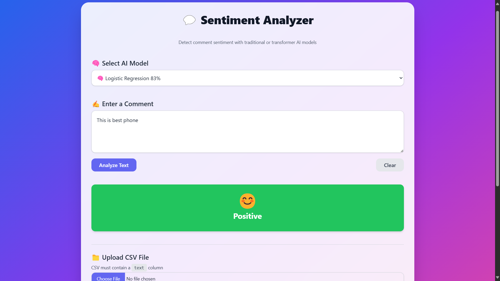
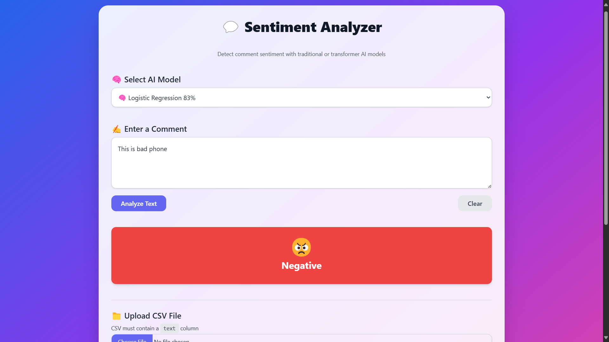
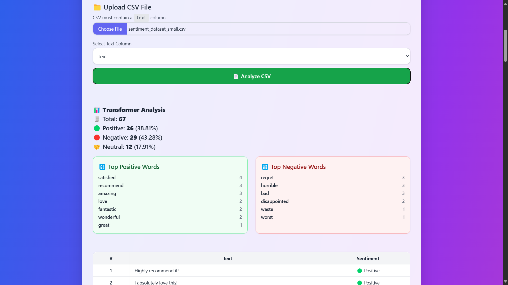
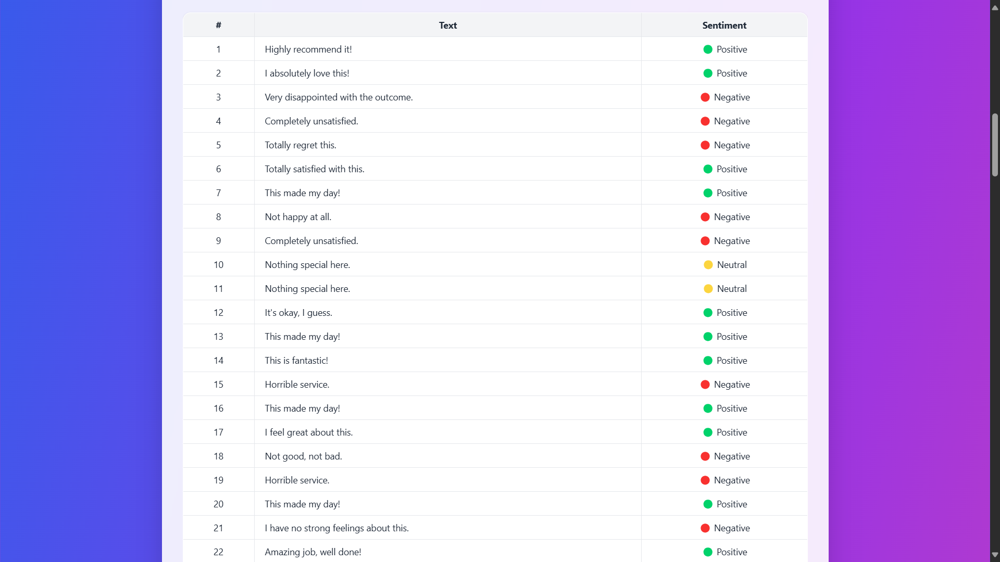
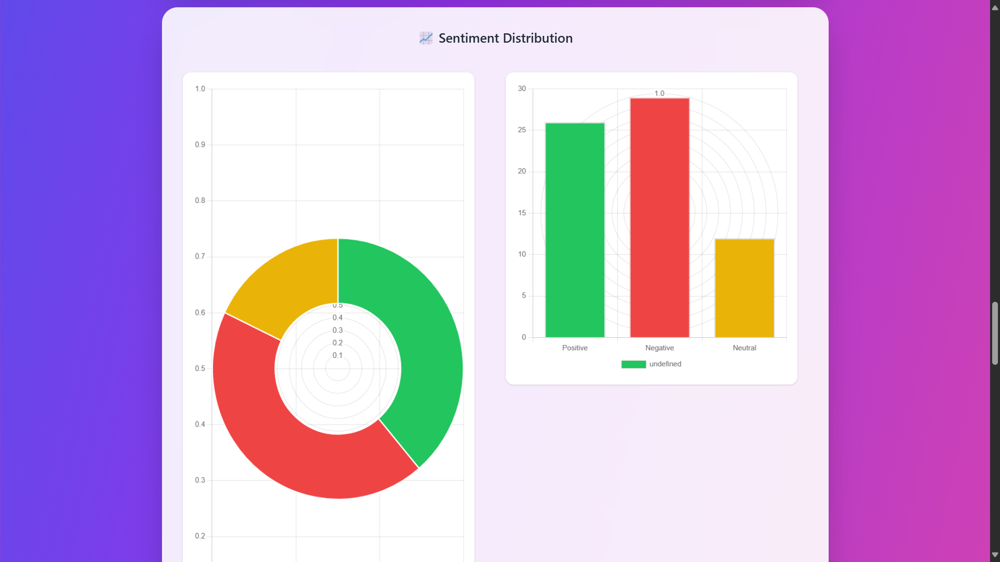

# 💬 Sentiment Analyzer

A powerful and beautifully designed web-based sentiment analysis tool using **FastAPI**, **Logistic Regression**, and **RoBERTa Transformers**. Analyze individual comments or entire CSV files with real-time feedback and visual insights.

---


## ✨ Features

- 🧠 AI Model Options: Logistic Regression (83%) or RoBERTa (99%)
- 📄 Upload CSV files and get full sentiment breakdowns
- 📊 Dynamic visualizations with Chart.js
- 🎨 Tailwind CSS powered modern UI
- 🔠 Word frequency analyzer for positive/negative terms
- ⚡ Built with FastAPI + Transformers + scikit-learn

---

## 🖼 Preview

| Analyze Text Prediction Result CSV Upload |
|--------------|
|  |
|  |
|  |
|  |

| Chart1 Display | Chart2 Display | Chart3 Display |
|---------------|--------------|--------------------|
|  |  |  |

---

## 📁 Project Structure

```
sentiment-analyzer/
├── backend/
│   ├── app.py                  # FastAPI backend
│   ├── preprocess.py           # Text preprocessing
│   ├── logistic_model.pkl      # Trained model
│   └── tfidf_vectorizer.pkl    # TF-IDF vectorizer
├── frontend/
│   └── index.html              # Beautiful Tailwind CSS UI
├── requirements.txt
└── README.md
```

---

## 🚀 Installation Guide

### 1. Clone the repository

```bash
git clone https://github.com/your-username/sentiment-analyzer.git
cd sentiment-analyzer
```

### 2. Set up the backend

```bash
cd backend
pip install -r requirements.txt
uvicorn app:app --reload
```

### 3. Run the frontend

Open `frontend/index.html` in your browser.

---

## 🧪 API Endpoints

| Method | Endpoint         | Description                          |
|--------|------------------|--------------------------------------|
| GET    | `/`              | Welcome screen with app info         |
| POST   | `/predict-text/` | Predict sentiment from single text   |
| POST   | `/predict-csv/`  | Upload CSV for batch sentiment       |

---

## 👨‍💻 Developers

<div align="center">
  
</div>

| 👤 Dosty Pshtiwan | 👤 Bander Sidiq |
|------------------|----------------|
| AI developer     | AI developer   |
| [GitHub](https://github.com/dosty17) | [GitHub](https://github.com/bandersidiq) |

---

## 📄 License

Licensed under the [MIT License](LICENSE).

---


